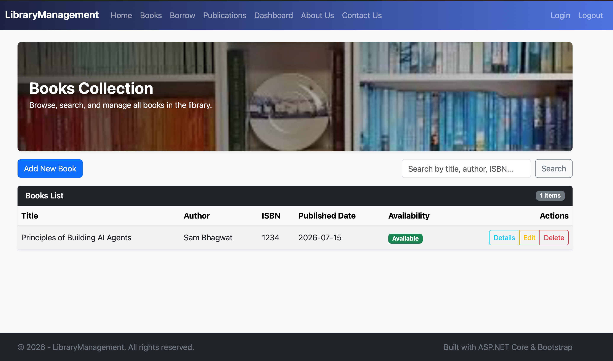

# Library Management System – MPOnline Internship Project

This project is a **web-based Library Management System** developed as part of the **MPOnline internship**.  
It is built using **ASP.NET Core MVC**, **C#**, and **Bootstrap**, and provides a modern interface for managing books, students, librarians, borrowing records, and publications. [file:21][file:23]

- **Author:** Nikhil Sirohi
- **Guide:** Rupesh Sir

---

## 📸 Screenshots

---

## 1. Project Overview

The Library Management System is designed to help libraries:

- Maintain a catalog of books, newspapers, and magazines
- Manage student and librarian information
- Track book borrowing and returns
- Provide an admin dashboard with key statistics

The application follows the **MVC architectural pattern**:

- **Models** represent domain entities (Book, Student, Librarian, BorrowRecord, Publication, Login, Dashboard, etc.).
- **Views** are Razor pages styled with Bootstrap, providing responsive, card-based UIs.
- **Controllers** handle requests, business logic, and data access via Entity Framework Core or ADO.NET. [file:21][file:23]

---

## 2. Features

### 2.1 Authentication and Roles

- Login module using a `LoginModel` and `logintab` table.
- Sample users include Admin, Student, and Librarian roles.
- Successful login redirects to the **Admin Dashboard**. [file:21]

### 2.2 Admin Dashboard

- Displays key counts:
  - Total Students
  - Total Books
  - Total Librarians
  - Total Borrowings
- Uses `DashboardModel` and coloured Bootstrap cards with clear numeric stats. [file:21]

### 2.3 Books Module

- CRUD operations for books (Create, Read, Update, Delete).
- Fields: Title, Author, ISBN, PublishedDate, IsAvailable.
- Search and pagination:
  - Search by Title, Author, or ISBN.
  - Pagination with a configurable page size using `Skip` and `Take`.
- Uses `BookListViewModel` to pass:
  - `Books` collection
  - `SearchQuery`
  - `CurrentPage`
  - `TotalPages` [file:23]

### 2.4 Students Module

- Manage student records: `StudentId`, `StudentName`, `Email`, `Phone`.
- CRUD operations for students.
- Optional search and pagination via `StudentIndexViewModel`.
- UI: card-based list, search bar, table, and an “Add Student” form. [file:21][file:23]

### 2.5 Librarians Module

- Manage librarians: `LibrarianId`, `Name`, `Age`, `Phone`.
- CRUD operations for librarians.
- Search and pagination via `LibrarianIndexViewModel`.
- UI similar to Students, with card layout and table. [file:21][file:23]

### 2.6 Borrowing Module

- Tracks borrowing history:
  - Book title (via `Book` navigation)
  - Borrower name
  - Borrow date
  - Return date
  - Status (Active / Returned)
- Presented as a card + table view with badges for status. [file:23]

### 2.7 Publications Module (Newspapers & Magazines)

- Single `Publication` model with `PublicationType` enum (Newspaper, Magazine).
- Fields: `Id`, `Title`, `Publisher`, `PublishedDate`, `Type`, `IsAvailable`.
- Shared controller and views:
  - `type` route parameter selects Newspapers or Magazines.
  - Search by title or publisher.
  - Pagination with `pageNumber` and `pageSize`.
- UI: shared index view that adjusts headings and buttons based on current type. [file:23]

### 2.8 Home, About, Contact

- **Home:** Hero banner, featured module cards, announcements (New Arrivals, Library Hours).
- **About:** Description of the project, goals, and mission.
- **Contact:** Simple contact form plus static address and email info. [file:21][file:23]

### 2.9 Shared Layout and Navigation

- `_Layout.cshtml` defines:
  - Navbar with links to Home, Books, Borrow, Publications, Students, Librarians, Dashboard, Login, Logout, About, Contact.
  - Footer with © year and project name.
  - Consistent Bootstrap theme across all pages. [file:21][file:23]

---

## 3. Technology Stack

- **Backend:** ASP.NET Core MVC (C#)
- **Frontend:** Razor Views, Bootstrap 5
- **Data Access:**
  - Entity Framework Core via `LibraryContext`
  - ADO.NET (`SqlConnection`, SQL queries) for some modules and sample data
- **Database:** SQL Server or EF Core InMemory (for testing). [file:21][file:23]

---

## 4. Getting Started

### 4.1 Prerequisites

- .NET SDK (6.0 or later)
- SQL Server (for full DB setup) or InMemory configuration
- Visual Studio / VS Code

### 4.2 Running the Project

1. Clone this repository.
2. Open the solution in Visual Studio or VS Code.
3. Restore NuGet packages and build the solution.
4. Run the web project (e.g., `LMSystem.Web`).
5. Navigate to `http://localhost:<port>` in your browser.

Use the configured admin credentials (from `logintab`) to access the dashboard and management modules. [file:21]

---

## 5. Future Improvements

- Full role-based authorization using ASP.NET Core Identity.
- Report generation (PDF/Excel) for books and borrowing.
- Additional modules: Categories, Fines, Reservations, etc.
- Deployment to cloud (Azure or similar) with production-grade SQL Server. [file:23]

---

## 6. Acknowledgements

This project was completed as part of the **MPOnline internship**.

- **Developed by:** Nikhil Sirohi
- **Guided by:** Rupesh Sir

Thank you to MPOnline and all mentors for guidance and support throughout the project.
